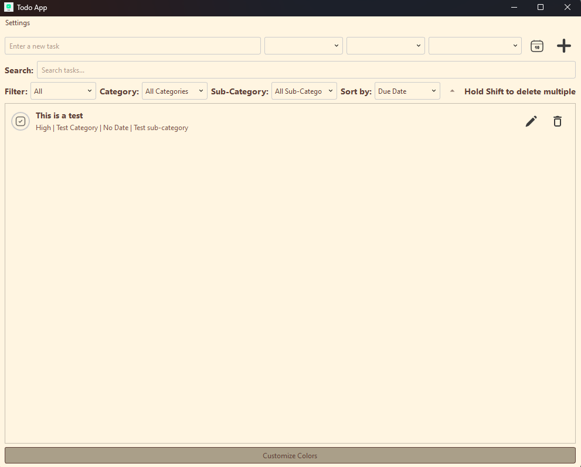
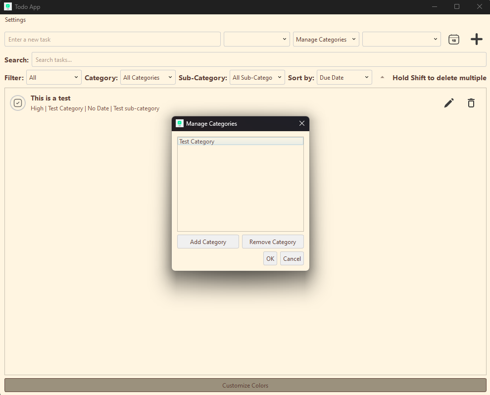
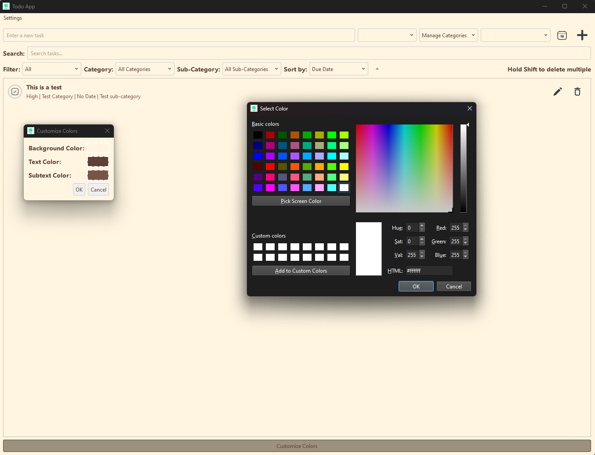

# Todo2 - A Modern Desktop Task Manager

Todo2 is a feature-rich desktop task management application built with Python and PySide6. It offers a clean, intuitive interface while providing powerful organization features and customization options. I made it with the help of Claude 3.5 Sonnet with the goal of using it in work on my Windows laptop.

## ✨ Key Features

- 🗂️ **Smart Organization**
  - Organize tasks with categories and subcategories
  - Filter and sort tasks by multiple criteria
  - Quick task creation with keyboard shortcuts
  - Multi-select tasks for batch operations

- 📅 **Date Management**
  - Set due dates for tasks
  - Customizable date format
  - Visual indicators for overdue tasks

- 🎨 **Customization**
  - Fully customizable color themes
  - Dark/light mode support
  - Adjustable UI elements

- 📝 **Rich Task Details**
  - Add detailed notes to tasks
  - Priority levels
  - Task completion tracking
  - Task descriptions

- 💾 **Data Management**
  - Automatic saving
  - SQLite database backend
  - Efficient data handling

## 🚀 Getting Started

### Prerequisites
- Python 3.7 or higher
- PySide6 (Qt for Python)

### Installation

1. Clone the repository:
   ```bash
   git clone https://github.com/yourusername/Todo2.git
   cd Todo2/todo_app
   ```

2. Install dependencies:
   ```bash
   pip install -r requirements.txt
   ```

3. Run the application:
   ```bash
   python src/main.py
   ```

### Building from Source

For detailed instructions on building a standalone executable, see [BUILD_GUIDE.md](docs/BUILD_GUIDE.md).

## 🎯 Usage

1. **Adding Tasks**
   - Type your task in the input field
   - Set priority, category, and due date (optional)
   - Press Enter or click the add button

2. **Managing Tasks**
   - Click the checkbox to mark tasks as complete
   - Use the edit button to modify task details
   - Hold Shift to select multiple tasks for deletion
   - Filter tasks using the dropdown menus
   - Sort tasks by due date, priority, or category

3. **Customization**
   - Click "Customize Colors" to change the application theme
   - Adjust date formats through Settings > Date Format
   - Manage categories and subcategories through their respective dropdowns

For detailed UI customization information, see [UI_STYLING_GUIDE.md](docs/UI_STYLING_GUIDE.md).

## 🤝 Contributing

Contributions are welcome! This project is perfect for both beginners and experienced developers. Here's how you can help:

### Areas for Contribution

- 🐛 Bug fixes and improvements
- ✨ New features
- 🎨 UI/UX enhancements
- 📝 Documentation improvements
-  General code improvements

### Getting Started with Development

1. Fork the repository
2. Create a feature branch (`git checkout -b feature/AmazingFeature`)
3. Make your changes
4. Commit your changes (`git commit -m 'Add some AmazingFeature'`)
5. Push to the branch (`git push origin feature/AmazingFeature`)
6. Open a Pull Request

See our [contribution guidelines](CONTRIBUTING.md) for more details.

## 🗺️ Roadmap

Future development plans include:

- [ ] Task reminders and notifications
- [ ] Cloud sync capabilities
- [ ] Data import/export features


## 🛠️ Technical Details

- **Backend**: Python with SQLite database
- **Frontend**: PySide6 (Qt for Python)
- **Architecture**: MVC pattern
- **Build System**: PyInstaller for creating standalone executables

## 📄 License

This project is licensed under the MIT License - see the [LICENSE](LICENSE) file for details.

## 🙏 Acknowledgments

- Built with [PySide6](https://wiki.qt.io/Qt_for_Python)

## 📸 Screenshots
*Main application interface with task list and controls*


*Category management interface*


*Color customization dialog*



---
